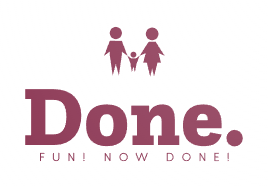
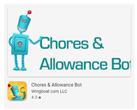
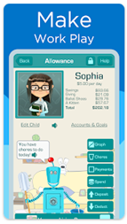
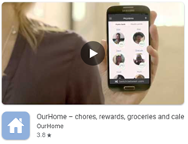
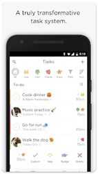
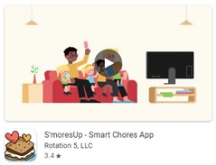
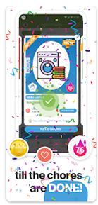
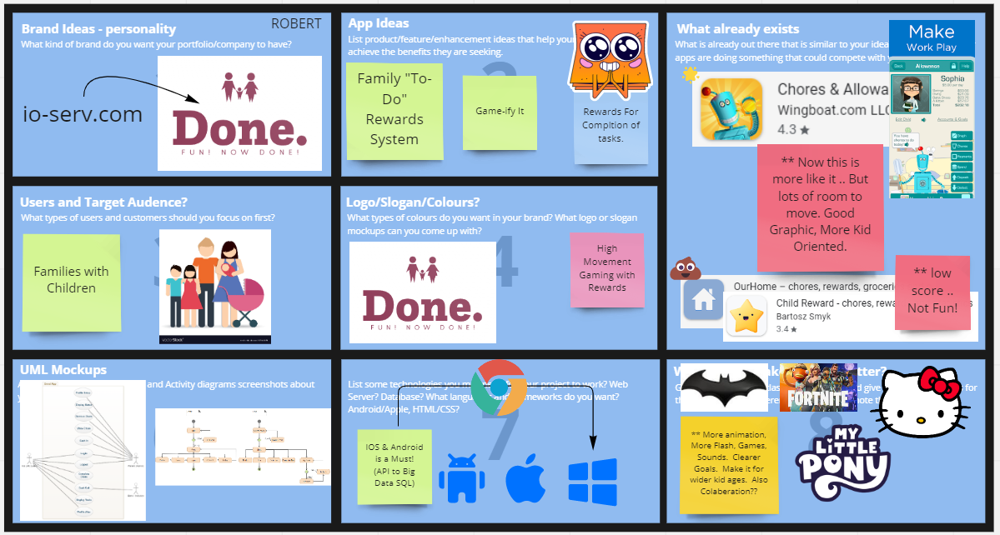
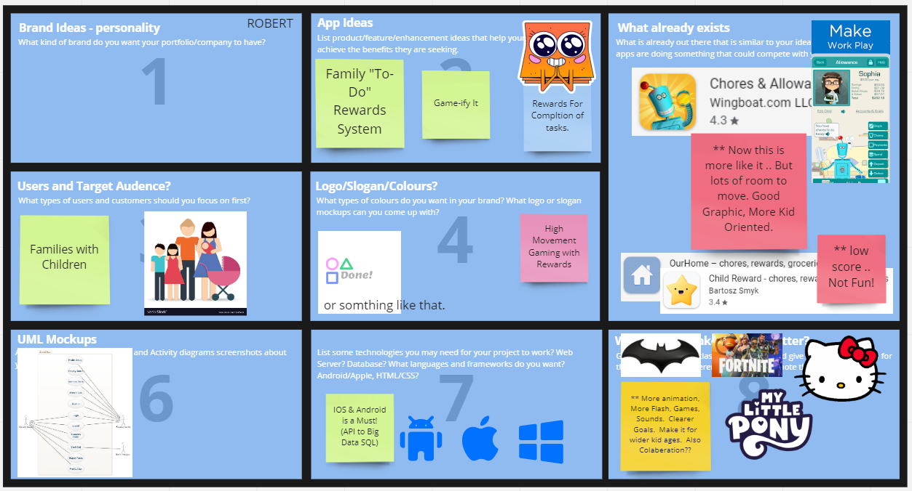
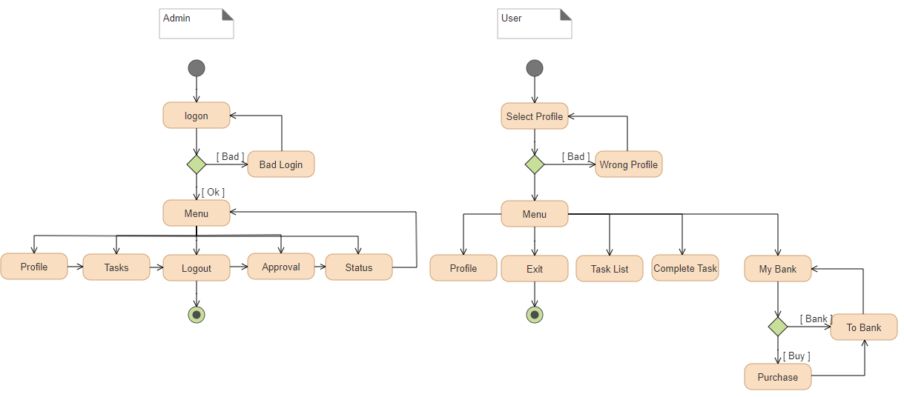

# Program Name (MDEV1012-22S-31310 - Georgian College, 2022)
# Business Proposal - Robert Bettinelli 
# Done. – Family To Do Awards App.

# Description

Parents are busy people.  House holds have many chores to do.  Hundreds when broken down and then you think of re-occurring items; it becomes mind bending.   The question becomes “how can we leverage the kids to become engaged and helpful?”  Let’s get everyone to help.  Kids respond to being rewarded. Kids respond to games and fun things to do.  We plan on combining these items that will allow them to make things fun and for them to get rewarded; not just handing them an allowance; but the ability to gain real money for real world items.   Simple setup and startup for the parent (admins) and clear instructions that are colourful and have a fun gaming feeling for the kids (users).  The app will be split up into admin and user access.  The parents will be able to add and structure the chores and their excepted rewards.   The kids will be able to see what is available to do; and to complete tasks gaining their rewards once approved by the parent.  Once rewards have been accumulated, they will then be able to keep it “in bank” or to make purchases by pre-approved sites.  (See diagram 1 and diagram 2) to functional plan. 

# Components

<ol>
  <li>Server back-end Database </li>
  <li>Server based API</li>
  <li>Android Application to support admin and kid use. </li>
</ol>

# Technology

<ol>
  <li>IIS 10.0 - ASPX API</li>
  <li>MS-SQL 2019</li>
  <li>Android Studio (current)</li>
</ol>

# Existing Apps

| # | App | Screen | Details | 
|---|:---:|:---:|:---:|
| 1 |  |  | High rating.  Graphically appealing. Some customizations.  Other than monetary incentive. Not fun. | 
| 2 | | |Lower rating. No Graphics. Basic layout. More parents driven.  | 
| 3 | | | Lower rating. Some pages graphically appealing. Looks more like a social app.  No incentive other than hearts and sparkles. |

# Target Audience

In Canada Households with:

Two children : 2,209,080

Three or more children	:1,014,310

---

In the US stats are a bit different: 
2, 2020 — Newly released estimates from the U.S. Census Bureau's annual America's Families and Living Arrangements release show that the number of parents with children under age 18 and living at home declined by about 3 million over the past decade, dropping from about 66.1 million parents in 2010 to 63.1 million

---

To be specific.  The current target audience are parents with children in the household.  For 1st version they must have an Android device (tablet or phone).   As shown above the US and Canada have a largely untapped market.  

To gain traction I find that a digital front marketing would work very well, such as online marketing; as many free sites or posting as possible. Although on a secondary front a flyer system for local stores may also be an old school method.  Given the stats above the odds of providing a flyer to a non-parent should be low.

# Miro Latest

# Miro Screen Caps (old)

# Use Case (Diagram 1)

# Activity (Diagram 2) 

# Updates

| # | Date | Update | 
|---|:---:|:---:|
| 1 | 06/13/2022 | Move to MASTER - 1st Version Uploaded. Main Stuff Moved |
| 2 | | |
